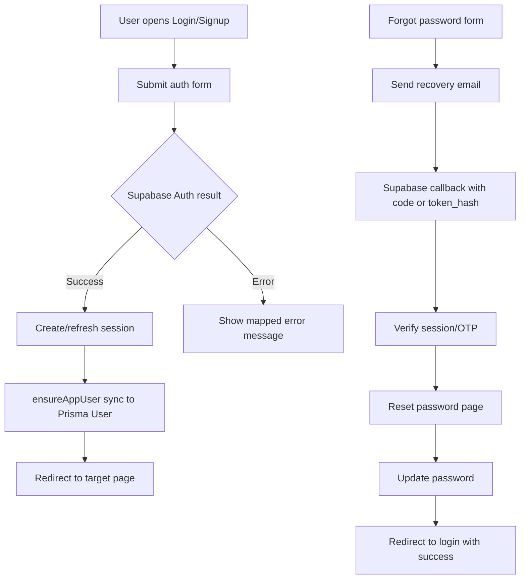
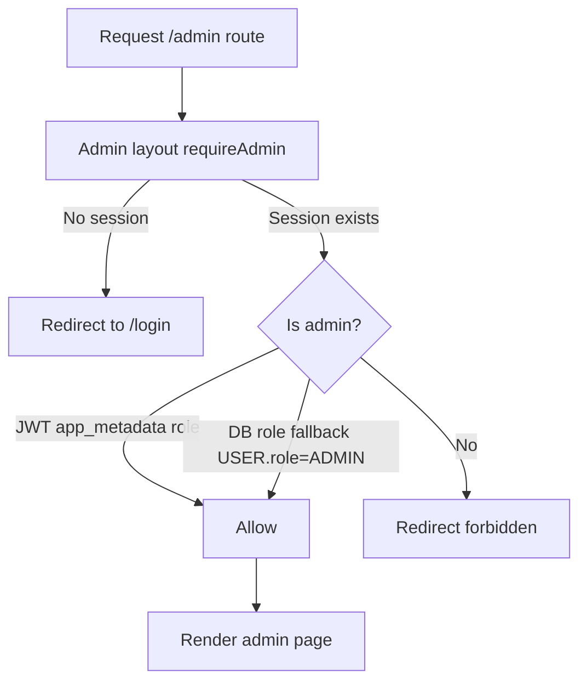
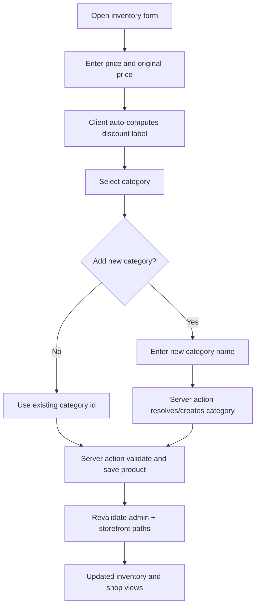
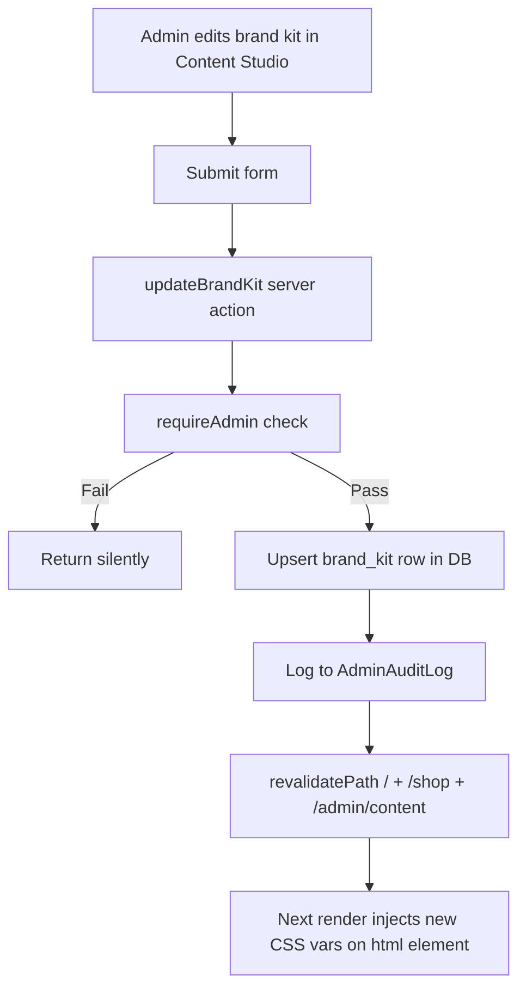

# AnavaSilks System Design

For route tables, environment variables, and a feature-level inventory of the current build, see [Application specification](./spec.md). This document focuses on architecture, flows, and design rationale.

## 1) Objectives

- Deliver a premium silk e-commerce storefront with admin-managed content and catalog.
- Keep authentication and admin authorization secure and operational.
- Ensure admin UI follows brand kit settings managed from Content Studio.
- Support fast iteration in Next.js App Router with Supabase + Prisma backend.

## 2) High-Level Architecture

- **Frontend Runtime**: Next.js 16 App Router (`src/app`) with React 19, server-first pages and client islands.
- **Auth Provider**: Supabase Auth (email/password, recovery, callback verification).
- **Data Access**: Prisma ORM on PostgreSQL (Supabase Postgres).
- **Storage/CDN**: Cloudinary-ready image model fields (`url`, `publicId`) for catalog/content assets.
- **Admin Surface**: `/admin/*` routes with server-side admin guard and API/server-action mutations.

## 3) Core Modules

### 3.1 Storefront

- Home, shop, product detail, cart, checkout, account routes, and static marketing pages (`/about`, `/collections`, `/new-arrivals`).
- Navbar + **hero carousel** (one slide per active `HomeHero` row) + highlights + promo blocks pull from DB-backed content models.
- Fallback sample data is used only when expected DB tables are unavailable.

### 3.2 Admin Console

- Dashboard, orders, inventory, categories, customers, reviews, content studio, newsletter, payments/general settings, plus informational pages for banners, coupons, shipping, and taxes (see spec for sidebar vs direct URL).
- Content Studio manages:
  - `BrandKit`
  - `HomeHero`
  - `CollectionHighlight`
  - `NavPromoBlock`
- Inventory now supports create/edit/delete workflows through server actions.

### 3.3 Auth & Authorization

- Session and user identity from Supabase.
- Admin authorization strategy:
  - Primary: JWT `app_metadata` admin role.
  - Fallback: DB role (`User.role = ADMIN`) for resilience.
- Optional MFA enforcement for admins via env flag.

## 4) Data Model (Key Entities)

- **User**: identity, profile, role (`USER`/`ADMIN`), relationships to orders/addresses/reviews.
- **Category**: catalog taxonomy with slug.
- **Product**: title, slug, pricing, stock, status flags, category relation.
- **ProductImage/ProductColor**: media and variation attributes.
- **Order/OrderItem**: order snapshots and line items.
- **BrandKit/HomeHero/CollectionHighlight/NavPromoBlock**: managed content for shell/pages.
- **NewsletterSubscription**: footer / marketing signups.
- **WishlistItem**: authenticated wishlist rows; storefront syncs via `/api/wishlist`.
- **AdminAuditLog**: admin action event log for mutating operations.

## 5) Request/Action Flows

### 5.1 Login / Signup / Reset Password

- `login` + `signup` use server actions (`src/app/auth/actions.ts`).
- Callback route handles:
  - `code` exchange flow
  - `token_hash + type` OTP/recovery flow
- Reset sequence:
  1. Forgot-password request sends email with callback redirect.
  2. Callback verifies recovery token.
  3. User lands on reset-password page and updates password.

### 5.2 Edge middleware (session gate)

- `src/middleware.ts` uses `@supabase/ssr` to refresh the session cookie on matching routes.
- Paths under `/admin` (or hostnames starting with `admin.`) require an authenticated Supabase user; unauthenticated requests redirect to `/login` with `redirectTo`. **Admin role is not evaluated in middleware** — the admin layout’s `requireAdmin()` is the authority for role and optional MFA.
- Authenticated users hitting `/login`, `/signup`, `/forgot-password`, or `/auth/*` are redirected to `/`.
- `admin.example` style hosts redirect `/` → `/admin`.

### 5.3 Admin Guard

- `src/app/admin/layout.tsx` enforces `requireAdmin()` server-side for every admin page render.
- Unauthenticated visitors are usually redirected to `/login` by **middleware** before the layout runs; if `requireAdmin()` still fails (no admin role in JWT or DB, optional MFA not satisfied, etc.), the layout redirects to `/?admin=forbidden`.
- Admin role resolution checks JWT `app_metadata` first, then DB `User.role = ADMIN` as fallback.

### 5.4 Inventory CRUD

- List/filter via admin data layer.
- Mutations via server actions:
  - create product
  - update product
  - soft delete product (`isActive=false`)
- Revalidation propagates updates to admin list and storefront pages.

## 6) Theming & Brand Kit Strategy

Brand kit is the single source of truth for **storefront** visual identity (CSS variables on `<html>`). The admin console uses a separate fixed chrome; see §6.2.

### 6.1 CSS Variable Injection

Brand tokens are loaded from the DB (or fallback constants) in `src/app/layout.tsx` and injected as inline CSS custom properties on the `<html>` element, making them available site-wide:

| CSS Variable           | DB Field           | Default            |
| ---------------------- | ------------------ | ------------------ |
| `--color-text`         | `primaryColor`     | `#171717`          |
| `--color-background`   | `secondaryColor`   | `#f6f4f0`          |
| `--color-accent`       | `accentColor`      | `#8b6a3e`          |
| `--color-surface`      | `surfaceColor`     | `#ffffff`          |
| `--color-text-muted`   | `mutedTextColor`   | `#6b6b6b`          |
| `--nav-letter-spacing` | `navLetterSpacing` | `0.22em`           |
| `--brand-heading-font` | `headingFont`      | `Playfair Display` |
| `--brand-body-font`    | `bodyFont`         | `Inter`            |

`globals.css` `@theme` holds the same values as static fallbacks for Tailwind utility generation and pre-hydration rendering.

### 6.2 Admin shell styling

The admin layout currently uses a **fixed neutral / black chrome** for the sidebar header and accents (for example `--admin-primary` is set to a fixed value on the admin root for legacy utility references). **Brand kit** values are still loaded for **sidebar branding copy** (`brandName`, `tagline`) and header context, not as the primary driver of admin CSS variables.

### 6.3 Font Loading

Fonts (Playfair Display for headings, Inter for body) are loaded statically via `next/font/google` at build time. The `headingFont`/`bodyFont` brand kit fields are reference metadata only — changing them requires a code deploy.

### 6.4 Revalidation

When brand kit is updated via Content Studio, `revalidatePath` is called for `/`, `/shop`, and `/admin/content` so the next server render picks up the new tokens.

## 7) Security Model

- Admin-only mutations require server-side admin checks.
- API handlers use `requireAdmin()` before write operations.
- Audit log captures actor/action/target metadata for admin changes.
- Redirect normalization prevents open redirect abuse in auth flows.

## 8) Scalability Considerations

- Pagination on order/product admin lists.
- Query indexes for common filters and sorting fields.
- Incremental migration path from server actions to queue/event-driven audit sinks if needed.
- Clear boundary between read models (`admin-data`) and write models (actions/routes).

## 9) Observability & Ops

- Build/lint validation in CI recommended (`npm run lint`, `npm run build`).
- Admin audit log table enables forensic review of privileged changes.
- Environment checks surfaced in admin settings for critical backend readiness.

## 10) Known Gaps / Next Recommended Work

- Add product media/color inline editor in inventory edit screen.
- Add bulk inventory actions (activate/deactivate/delete).
- Add coupon domain model and checkout integration before re-enabling Coupons as operational.
- Add richer shipping/tax configuration models for production-grade checkout logic.
- Add edit (update) flow for existing CollectionHighlight and NavPromoBlock records in Content Studio.
- Introduce `unstable_cache` with revalidate tags for brand kit and content reads to reduce DB hits per page load.

## 11) Workflow Visualization

### 11.1 Authentication Workflow

### 11.2 Admin Authorization Workflow

### 11.3 Inventory Create/Edit Workflow

### 11.4 Brand Kit Update Workflow

## 12) Feature Inventory (Current Build)

### 12.1 Storefront Features

- Brand-kit driven shell with 5 admin-managed color tokens + nav letter-spacing token.
- Hero **carousel** managed from admin (one slide per active `HomeHero` row).
- Featured collection cards managed from admin.
- Per-card embedded-text toggle:
  - `imageHasEmbeddedText = true` hides overlay title/subtitle on that card.
  - avoids contradiction when text already exists inside image assets.
- Shop mega menu with hover intent and promo cards.
- Product rail and product cards with discount badges, price strike-through, wishlist button.
- Account area: profile, addresses, orders, wishlist.
- `robots.txt` / `sitemap.xml` via App Router metadata routes when `NEXT_PUBLIC_SITE_URL` (or Vercel URL) is set.

### 12.2 Authentication Features

- Signup with full name metadata capture.
- Login with improved error mapping and password visibility toggle.
- Forgot-password and reset-password flow using callback verification.
- Callback supports both `code` and `token_hash + type` verification paths.
- Auth-aware navbar/account menu behavior.

### 12.3 Admin Features

- Dashboard metrics and recent operational insights.
- Orders list with filters and pagination.
- Inventory list with filters/pagination and working create/edit/delete.
- Live product-card preview in inventory form.
- Auto discount calculation from original price vs selling price.
- Inline `+ Add category` flow from inventory form.
- Categories CRUD (add/delete with safety check).
- Customers and reviews data views.
- Content Studio:
  - Brand kit editor with color pickers for all 5 color tokens
  - Hero editor
  - Collection highlights CRUD
  - Nav promo CRUD
  - Embedded-text checkbox for image cards
- Newsletter subscribers list.
- Settings pages: payments, general, plus informational shipping/taxes pages (not all linked from the primary sidebar).

### 12.4 Security and Governance

- Server-side admin enforcement in layout and API/action boundaries.
- Admin role resolution via JWT claims with DB fallback.
- Optional MFA-required admin mode via env toggle.
- Admin audit logging for privileged content operations.

### 12.5 Developer Experience / Operations

- Prisma migrations for schema changes and content/security models.
- Prisma 7 with `@prisma/adapter-pg` and `DATABASE_URL`; build-safe lazy client via `src/lib/prisma.ts`.
- Expected sample fallback handling for missing DB tables in non-ready states.
- Vitest unit tests (`npm run test`) and lint/build verification for iterative changes.
